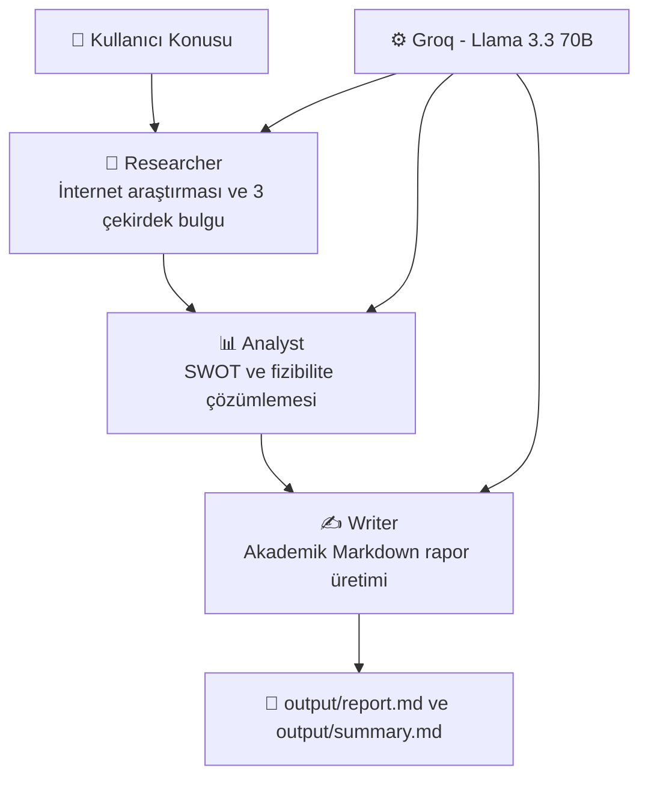

# Executive Summary (Yönetici Özeti)

**Analiz Süresi:** 58 Saniye  
**Model:** Llama 3.3 70B (Groq Altyapısı)

## 1) Stratejik Kapsam ve Çekirdek Bulgular
Bu çalışma, kuş gözlemciliği süreçlerinde yapay zeka temelli karar destek mekanizmalarının bilimsel ve operasyonel etkisini değerlendirmektedir. Rapor bulguları üç ana eksende yoğunlaşmaktadır: (i) kuş davranışı ve göç örüntülerinin derin öğrenme ile modellenmesi, (ii) ses işleme tabanlı tür tanıma/sınıflandırma, (iii) uydu verisi ve coğrafi bilgi sistemleri ile göç yollarının haritalandırılması. Bu yaklaşım, koruma politikalarının veri temelli biçimde güçlendirilmesi ve saha ekiplerinin önceliklendirme doğruluğunun artırılması açısından yüksek potansiyel sunmaktadır.

## 2) SWOT Özeti
| Güçlü Yönler | Zayıf Yönler | Fırsatlar | Tehditler |
| --- | --- | --- | --- |
| Derin öğrenme ve büyük veri ile yüksek çözünürlüklü ekolojik analiz olanağı | İlk kurulum ve bakım maliyetlerinin yüksek olabilmesi | Cambridge, Cornell ve NASA eksenindeki veri/iş birliği fırsatları | Güvenlik, uyumluluk ve operasyonel sürdürülebilirlik riskleri |
| Ses tanıma ile tür tespitinde otomasyon ve gözlem verimliliği | Entegrasyon karmaşıklığı ve teknik borç oluşma ihtimali | Disiplinler arası araştırma kapasitesinin artırılması | Yetkin insan kaynağına bağımlılık |
| Uydu verisi ile geniş ölçekli göç takibi | Süreç standardizasyonu eksikliği halinde kalite dalgalanması | Ulusal/uluslararası fon ve ortak proje imkanı | Artan işletim maliyeti baskısı |

## 3) Fizibilite Özeti (Jüri Karar Matrisi)
| Boyut | Değerlendirme | Kritik Risk | Gerekli Ön Koşul | Önerilen Eylem |
| --- | --- | --- | --- | --- |
| Teknik uygulanabilirlik | **Yüksek** - Teknoloji bileşenleri olgun ve uygulanabilir düzeydedir | Sistemler arası entegrasyon kırılganlığı | Mimari standartların ve veri sözleşmelerinin netleştirilmesi | Aşamalı pilot geliştirme + entegrasyon test otomasyonu |
| Ekip ve operasyon | **Orta-Yüksek** - Doğru kadro ile sürdürülebilir | Uzmanlık açığı nedeniyle zaman/maliyet sapması | Hedefli eğitim, rol bazlı yetkinlik planı | Akademik-sanayi mentorluk modeli ve düzenli teknik değerlendirme |
| Güvenlik ve uyumluluk | **Orta** - Yönetilebilir, ancak sürekli takip gerektirir | Veri gizliliği ve mevzuat uyum ihlali | Güvenlik politikaları ve denetim takvimi | DevSecOps kontrolleri, periyodik sızma testi, uyum kontrol listesi |
| Ölçeklenebilirlik | **Yüksek** - Veri ve işlem artışına uyarlanabilir | Kaynak planlaması yetersizliği | İzleme metriklerinin ve kapasite sınırlarının tanımlanması | Kademeli ölçekleme, performans testleri ve bulut maliyet optimizasyonu |

## 4) Sonuç ve Yönetici Kararı
Mevcut bulgular, projenin akademik ve teknik açıdan **uygulanabilir** olduğunu; ancak başarının entegrasyon disiplini, güvenlik yönetişimi ve ekip yetkinliğine doğrudan bağlı olduğunu göstermektedir. Jüri perspektifinden en rasyonel yaklaşım, kısa vadede kontrollü pilot uygulama ile doğrulama yapmak, orta vadede kurumsal standartları oturtmak ve uzun vadede sürdürülebilir ölçeklenebilirliği güvence altına almaktır.

---
Bu özet, Fırat Üniversitesi Yazılım Mühendisliği Bölümü için Mehmet Özerli tarafından CrewAI ve Groq altyapısı kullanılarak otonom olarak üretilen rapordan türetilmiştir.
